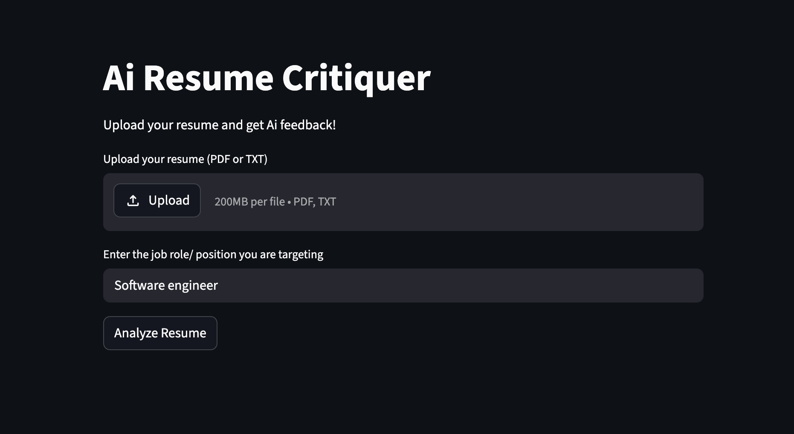

# AI Resume Critiquer

A Streamlit app that uses OpenAI's GPT model to analyze and provide feedback on resumes.



## Setup

1. Clone the repository
2. Install dependencies: `uv sync`
3. Copy your `OPEN_AI_API_KEY` to `.env` and add your OpenAI API key:

   ```
   OPEN_AI_KEY=your_actual_openai_api_key_here
   ```
4. Run the app: `uv run streamlit run main.py`

## Deployment

For public deployment, use Streamlit Cloud and set the OPEN_AI_KEY in the app secrets.

## Security Notes

- Never commit your `.env` file or API keys to the repository
- The app includes a 10MB file size limit for uploads